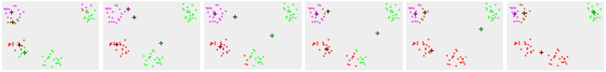
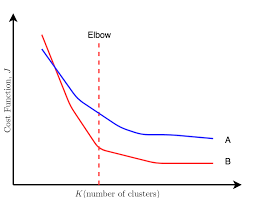

# K-means

> **K-means clustering** is a method of [vector quantization](https://en.wikipedia.org/wiki/Vector_quantization), originally from [signal processing](https://en.wikipedia.org/wiki/Signal_processing), that is popular for [cluster analysis](https://en.wikipedia.org/wiki/Cluster_analysis) in [data mining](https://en.wikipedia.org/wiki/Data_mining). *k*-means clustering aims to [partition](https://en.wikipedia.org/wiki/Partition_of_a_set) *n* observations into *k* clusters in which each observation belongs to the cluster with the nearest [mean](https://en.wikipedia.org/wiki/Mean), serving as a prototype of the cluster. This results in a partitioning of the data space into [Voronoi cells](https://en.wikipedia.org/wiki/Voronoi_cell).

## Input

- Training examples $\{x^{(1)}, x^{(2)}, \cdots, x^{(m)}\} \in \mathbb{R^n}$ , with no bias terms
- $\mathrm{K}$ clusters

## Algorithm

1. Randomly Initalise $\mathrm{K}$ cluster centroids $\mu_1,\mu_2, \cdots,\mu_\mathrm{K} \in \mathbb{R^n}$
2. Then, 

$$
\begin{align}
Repeat \{ \\
    \text{for }i &= 1\text{ to }m \\
        & c^{(i)} =\text{ index (from }1\text{ to }K\text{) of centroid closest to }x^{(i)}\text{, i.e., } min_k \lVert x^{(i)} - \mu_k \rVert^2 \\
    \text{for }k &= 1\text{ to }K \\
        & \mu_k =\text{ average (mean) of points assigned to cluster, }k\text{, i.e., } \frac {\text{sum of } x^{(i)}\text{, where }c^{(i)} = k} {\text{number of }c^{(i)} = k} \\
\}
\end{align}
$$

> $(2) \text{ and } (3)$ belong to the cluster assignment step
>
> $(4) \text{ and } (5)$ belong to the move centroid step

Here, k-means can also be applied to non-separated clusters as well.

## Optimisation Objective

- $c^{(i)}$ - index of cluster $\{1,2,\cdots,\mathrm{K}\}$ to which example $x^{(i)}$ is currently assigned
- $\mu_k$ - cluster centroid $k \space (\mu_k \in \mathbb{R^n})$ 
- $\mu_{c^{(i)}}$ - cluster centroid of cluster o which $x^{(i)}$ has been assigned

Based on the above notation, the cost function is given as,

$$
J(c^{(1)}, \cdots, c^{(m)}, \mu_1,\cdots, \mu_\mathrm{K}) = \frac{1}{m}\sum_{i=1}^m \lVert x^{(i)} - \mu_{c^{(i)}}\rVert^2
$$
There the objective is to minimise the cost based on $\{c^{(1)}, \cdots, c^{(m)}, \mu_1,\cdots, \mu_\mathrm{K}\}$

> The cost function for k-means is also called the distortion function

According to the algorithm, we do the following,
$$
\begin{align}
&\text{Cluster Assignment Step - }\\
& \quad\text{minimize J wrt } \{c^{(1)}, \cdots, c^{(m)}\} \text{ while holding } \{\mu_1, \cdots, \mu_k\} \text{constant}\\
&\text{Move Centroid Step - }\\
& \quad\text{minimize J wrt } \{\mu_1, \cdots, \mu_k\}\\
\end{align}
$$

> The cost function vs. no of iterations for k-means is **always** monotonically decreasing

## Random Initialisation

There are many ways to randomly initialise $\mathbb{K}$ cluster centroids, but one important thing to note is that $\mathbb{K} < m$. The recommended way is to pick $\mathbb{K}$ training examples and assign them to $\{\mu_1, \cdots, \mu_k\}$ . Depending on the initialisations of the clusters, we can end up at different solutions. Typically, we repeat the k-means algorithm 50-1000 times and select the clustering that minimises $J(c^{(1)}), \cdots, c^{(m)}, \mu_1,\cdots,\mu_k)$ . For 2-10 clusters performing random initialisation results in a serious increase in performance and accuracy but decreases if there are more clusters in the data. The following figure illustrates a case where the random initialisation converges to a bad local optima. 

## Choosing the number of Clusters

- Manually visualize the data. 
- **Elbow Method**
  - On plotting the distortion as a function of number of clusters, $\mathbb{K}$, this methods says that the optimal number of clusters at the point the elbow occurs as can be seen for line B in the plot below. It is a reasonable way of choosing the number of clusters. But this method does not always work because the sometimes the plot would look like line A which does not have clear elbow to choose.
  - 

- Sometimes it is ambiguous as to how many clusters exist in the dataset and in such cases it’s more useful to choose the number of clusters on the basis of the end goal.

## TODO

- Link to Voronoi Cells
- Link to example