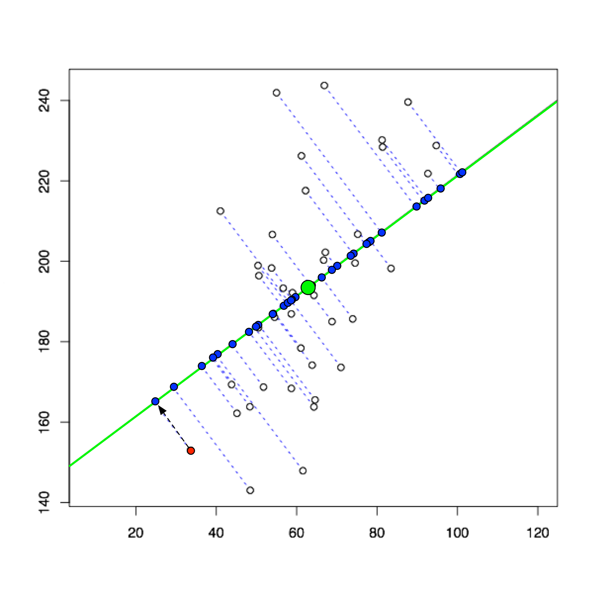

# Principal Component Analysis

> **Principal component analysis** (**PCA**) is a statistical procedure that uses an [orthogonal transformation](https://en.wikipedia.org/wiki/Orthogonal_transformation) to convert a set of observations of possibly correlated variablesinto a set of values of [linearly uncorrelated](https://en.wikipedia.org/wiki/Correlation_and_dependence) variables called **principal components**. If there are ${\displaystyle m}$ observations with ${\displaystyle n}$ variables, then the number of distinct principal components is ${\displaystyle \min(m-1, n)}$ . This transformation is defined in such a way that the first principal component has the largest possible [variance](https://en.wikipedia.org/wiki/Variance)(that is, accounts for as much of the variability in the data as possible), and each succeeding component in turn has the highest variance possible under the constraint that it is [orthogonal](https://en.wikipedia.org/wiki/Orthogonal) to the preceding components. The resulting vectors are an uncorrelated [orthogonal basis set](https://en.wikipedia.org/wiki/Orthogonal_basis_set). PCA is sensitive to the relative scaling of the original variables.




## Objective

- Reduce the dimensionality of the data. Eg, 3D $\{x_1, x_2, x_3\}$ to 2D $$\{z_1, z_2\}$$ involves projecting the 3D data onto a 2D plane such that the distance of the projections from the points onto the plane is the least. Or $x^{(i)} \in \mathbb{R^3} \to z^{(i)} \in \mathbb{R^2}$
- In the above figure, the blue points represent the projected points and the blue dashed lines represent the projections. Or $x^{(i)} \in \mathbb{R^2} \to z^{(i)} \in \mathbb{R}$
- More generally, reduce $\text{n-dimension}$ to $\text{k-dimension}$ : Find $k$ vectors $u^{(1)},\cdots, u^{(k)}$ onto which to project the data, so as to minimise the projection error.

> PCA is not linear regression, PCA focuses on projection error, ie., shortest distance from point to the plane. Whereas in linear regression we focus on the vertical distance $y$.

## Input

- Training examples $\{x^{(1)},\cdots,x^{(m)}\}$ with $n$ features represented as $x_j^{(i)}$

## Algorithm

- Preprocessing: Mean-normalisation and feature-scaling

  $$
  \begin{align}
  \mu_j &= \frac{1}{m}\sum_{i=1}^m x_j^{(i)} \\
  s_j &= max(x_j) - min(x_j) \text{ or } \sqrt{\frac{\sum_{i=1}^m (x_j^{(i)} - \mu_j)^2}{m}} \\
  x_j^{(i)} &\leftarrow \frac{x_j^{(i)} - \mu_j}{s_j} \\
  \end{align}
  $$

- Compute Covariance Matrix:

  $$
  \Sigma = \frac{1}{m}\sum_{i=1}^n(x^{(i)})(x^{(i)})^T \in \mathbb{R^{n \times n}}
  $$

  - $x^{(i)}$ is a $n \times 1$ vector, so, $\Sigma$ is a $n \times n$ matrix

- Compute eigenvectors of matrix $\Sigma$, 

  - ```octave
    [U, S, V] = svd(Sigma);
    ```

  - $U$ and $V$ are orthogonal and $S$ is a diagonal matrix 

  - The matrix $U$ are given by,
  $$
  U = \begin{bmatrix}
  \vdots & \vdots & \vdots & \vdots \\
  u^{(1)} & u^{(2)} & \cdots & u^{(n)}\\
  \vdots & \vdots & \vdots & \vdots \\
  \end{bmatrix} \in \mathrm{R^{n \times n}}
  $$

  - To generate $k$ dimesional reduction we use first $k$ columns of the $U$ matrix,

  $$
  U_{reduce} = \begin{bmatrix}
  \vdots & \vdots & \vdots & \vdots \\
  u^{(1)} & u^{(2)} & \cdots & u^{(k)}\\
  \vdots & \vdots & \vdots & \vdots \\
  \end{bmatrix} \in \mathrm{R^{n \times k}}
  $$

  - So, to get $x^{(i)} \in \mathbb{R^n} \to z^{(i)} \in \mathbb{R^k}$,

  $$
  \begin{align}
  z^{(i)} &= U_{reduce}^T \space x^{(i)} \in \mathrm{R^{k \times 1}}\\
  &\text{or} \\
  z^{(i)} &=  \begin{bmatrix}
  \vdots & \vdots & \vdots & \vdots \\
  u^{(1)} & u^{(2)} & \cdots & u^{(k)}\\
  \vdots & \vdots & \vdots & \vdots \\
  \end{bmatrix}^Tx^{(i)} \\
  \end{align}
  $$


## Reconstruction from Compressed Representation

- To get the original $x^{(i)}$,
  $$
  x_{approx}^{(i)} = U_{reduce}z^{(i)} \in \mathbb{R^{n \times 1}}
  $$


## Cost Function

- Average squared projection error,
  $$
  \frac{1}{m}\sum_{i=1}^m\lVert x^{(i)} - x_{approx}^{(i)} \rVert^2
  $$


## Choosing the number of Principal Components ($k$)

- Total variation in the data
  $$
  \text{Variation } = \frac{1}{m}\sum_{i=1}^m\lVert x^{(i)} \rVert^2
  $$

- Typically choose $k$ to be the lowest value so that,
  $$
  \frac{\frac{1}{m}\sum_{i=1}^m\lVert x^{(i)} - x_{approx}^{(i)} \rVert^2}{\frac{1}{m}\sum_{i=1}^m\lVert x^{(i)} \rVert^2} \le 0.01
  $$

- We like to `retain 99% of variance.`Talking about the amount of variance retained in more informative than citing the number of principal components retained. 

- To calculate $k$ do the following,
  $$
  \begin{align}
  & k = 0 \\
  & \text{Repeat} \{ \\
  &\quad k = k+1\\
  & \quad \text{Compute } U_{reduce}, z^{(1)}, \cdots, z^{(m)}, x_{approx}^{(1)}, \cdots, x_{approx}^{(m)} \\
  & \quad \text{Check if } \frac{\frac{1}{m}\sum_{i=1}^m\lVert x^{(i)} - x_{approx}^{(i)} \rVert^2}{\frac{1}{m}\sum_{i=1}^m\lVert x^{(i)} \rVert^2} \le 0.01 \text{ then break}\\
  &\} \\
  \end{align}
  $$

- From matrix $S$ from the SVD application,
  $$
  S = \begin{bmatrix}
  &s_{11}, &0, &\cdots, &0 \\
  &0, &s_{22}, &\cdots, &0 \\
  &\vdots, &\vdots, &\ddots, &\vdots \\
  &0, & 0, &\cdots, &s_{nn} \\
  \end{bmatrix}
  $$

- To calculate $k$ do the following,
  $$
  \begin{align}
  & k = 0 \\
  &\text{Repeat} \{ \\
  &\quad k = k+1  \\
  &\quad \text{Check if } \frac{\sum_{i=1}^k s_{ii}}{\sum_{i=1}^n s_{ii}} \ge 0.99 \text{ then break}\\
  &\} \\
  \end{align}
  $$


## Advice for Applying PCA

- Supervised learning speedup

  - Input $\{(x^{(1)},y^{(1)}), (x^{(2)},y^{(2)}), \cdots, (x^{(m)},y^{(m)})\}$ where $x^{(i)} \in \mathbb{R^{10000}}$

  - Apply PCA to change $x^{(i)} \in \mathbb{R^{10000}} \rightarrow z^{(i)} \in \mathbb{R^{1000}}$

  -  New training set : $\{(z^{(1)},y^{(1)}), (z^{(2)},y^{(2)}), \cdots, (z^{(m)},y^{(m)})\}$ 

  - > Run PCA only on training set to compute $U_{reduce}$ and use that mapping to calculate for $x_{test} \text{ or } x_{cv}$

- Compression

  - Reduce memory/disk usage
  - Speed up learning algorithm
  - $k = \text{ % of variance retained}$

- Visualization

  - $k = 2 \text{ or } 3$

- > ==DO NOT USE PCA to reduce overfitting go for regularisation instead==.  The reason it works well in some cases is because it reduces the number of features and hence reduces the variance and increases the bias.It is generally adviced against because PCA removes some information without keeping into consideration the target values. While this might work when 99% of the variance is retained, it may as well on various occasions lead to the loss of some useful information. On the other hand, regularization parameters are more optimal for preventing overfitting because while penalizing overfitting they also keep in context the values of the target vector.

- ==Try running models without using PCA first.==


## TODO

- Link to SVD
- Link to example