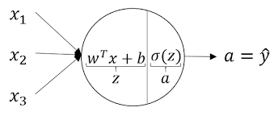
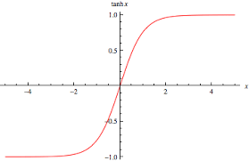
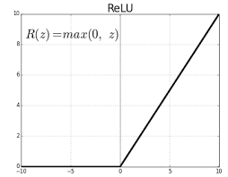
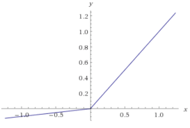

# Neural Networks

> An ANN is based on a collection of connected units or nodes called [artificial neurons](https://en.wikipedia.org/wiki/Artificial_neuron) which loosely model the [neurons](https://en.wikipedia.org/wiki/Neuron) in a biological [brain](https://en.wikipedia.org/wiki/Brain). Each connection, like the [synapses](https://en.wikipedia.org/wiki/Synapse) in a biological [brain](https://en.wikipedia.org/wiki/Brain), can transmit a signal from one artificial neuron to another. An artificial neuron that receives a signal can process it and then signal additional artificial neurons connected to it.


## Notation

- The above illustration is a **2 layer** neural network. We generally exclude the input layer while counting the number of layers.

- $$
  \begin{align}
  a^{[0]} &= X \label{eq1}\\
  a^{[1]} &= \begin{bmatrix} 
  a_1^{[1]} \\
  a_2^{[1]} \\
  a_3^{[1]} \\
  a_4^{[1]} \\
  \end{bmatrix} \in \mathrm{R^{\text{#hidden_units} \times 1}}\\
  a^{[2]} &= \hat{y} \label{eq3}\\
  \end{align}
  $$

- **The notation, $a^{[l]}_i$ implies the $i^\text{th}$ node of the $l^{\text{th}}$ layer.**

- This image shows a particular neuron and the computations that occur in it :

  

  - For each of the neurons in 2 layer NN given at the top of this page, we can write the following set of expressions :

  - $$
    \begin{align}
    z_1^{[1]} &= w_1^{[1]T}x + b_1,& \quad a_1^{[1]} &= \sigma{(z_1^{[1]})} \\
    z_2^{[1]} &= w_2^{[1]T}x + b_2,& \quad a_2^{[1]} &= \sigma{(z_2^{[1]})} \\
    z_3^{[1]} &= w_3^{[1]T}x + b_3,& \quad a_3^{[1]} &= \sigma{(z_3^{[1]})} \\
    z_4^{[1]} &= w_4^{[1]T}x + b_4,& \quad a_4^{[1]} &= \sigma{(z_4^{[1]})} \\
    \end{align}
    $$

  - Computing the above expressions in a `for` loop can be expensive so we use the vectorised form derived from :

  - $$
    \begin{align}
    z^{[1]} &= \underbrace{\begin{bmatrix}
    \cdots & w_1^{[1]T} &\cdots\\
    \cdots & w_2^{[1]T} &\cdots\\
    \cdots & w_3^{[1]T} &\cdots\\
    \cdots & w_4^{[1]T} &\cdots\\
    \end{bmatrix}}_{W^{[1]} \in \mathrm{R^{4\times3}}}
    \begin{bmatrix}
    x_1\\
    x_2\\
    x_3\\
    \end{bmatrix}
    + 
    \underbrace{\begin{bmatrix}
    b_1^{[1]}\\
    b_2^{[1]}\\
    b_3^{[1]}\\
    b_4^{[1]}\\
    \end{bmatrix}}_{b^{[1]} \in \mathrm{R^{4\times1}}} 
    = 
    \begin{bmatrix}
    z_1^{[1]}\\
    z_2^{[1]}\\
    z_3^{[1]}\\
    z_4^{[1]}\\
    \end{bmatrix} \\
    
    a^{[1]} &= \begin{bmatrix}
    a_1^{[1]}\\
    a_2^{[1]}\\
    a_3^{[1]}\\
    a_4^{[1]}\\
    \end{bmatrix}
    = \sigma{(z^{[1]})} \\
    
    &\text{or}\\
    
    \underbrace{z^{[1]}}_{(4,1)} &= \underbrace{W^{[1]}}_{(4,3)}\underbrace{x}_{(3,1)} + \underbrace{b^{[1]}}_{(4,1)} \\
    \underbrace{a^{[1]}}_{4,1} &= \underbrace{\sigma{(z^{[1]})}}_{(4,1)} \\
    \underbrace{z^{[2]}}_{(1,1)} &= \underbrace{W^{[2]}}_{(1,4)}\underbrace{a^{[1]}}_{(4,1)} + \underbrace{b^{[2]}}_{(1,1)} \\
    \underbrace{a^{[2]}}_{1,1} &= \underbrace{\sigma{(z^{[2]})}}_{(1,1)} \\
    \end{align}
    $$

  - From $\eqref{eq1}$ and $\eqref{eq3}$  the vectorised implementation will looks as follows :

  - $$
    \begin{align}
    z^{[1]} &= W^{[1]}a^{[0]} + b^{[1]} \\
    a^{[1]} &= \sigma{(z^{[1]})} \\
    z^{[2]} &= W^{[2]}a^{[1]} + b^{[2]} \\
    a^{[2]} &= \sigma{(z^{[2]})} = \hat{y}\\
    \end{align}
    $$

- More generally,

- $$
  \begin{align}
  Z^{[l]} &= W^{[l]}A^{[l-1]} + b^{[l]} \label{eq19}\\
  A^{[l]} &= g^{[l]}{(Z^{[l]})} \label{eq20}\\
  \end{align} \\
  \text{Where }g(z) \text{ represents some activation function}
  $$

  


## Forward Propagation

- This involves computing the activations and output of all layers in the forward pass :

- > `for i=1 to m:`
  > $$
  > \begin{align}
  > z^{[1](i)} &= W^{[1](i)}a^{[0](i)} + b^{[1](i)} \\
  > a^{[1](i)} &= \sigma{(z^{[1](i)})} \\
  > z^{[2](i)} &= W^{[2](i)}a^{[1](i)} + b^{[2](i)} \\
  > a^{[2](i)} &= \sigma{(z^{[2](i)})} = \hat{y}^{(i)}\\
  > \end{align}
  > $$
  > Recall that,
  > $$
  > X = \begin{bmatrix} 
  > \vdots & \vdots & \cdots & \vdots\\
  > X^{(1)} & X^{(2)} & \cdots & X^{(m)}\\
  > \vdots & \vdots & \cdots & \vdots\\
  > \end{bmatrix} \in \mathbb{R^{n \times m}}
  > $$
  >

- By stacking all column vectors we can get the vectorised form over all training examples this :

  - $$
    \begin{align}
    Z^{[1]} &= W^{[1]}A^{[0]} + b^{[1]} \\
    A^{[1]} &= \sigma{(Z^{[1]})} \\
    Z^{[2]} &= W^{[2]}A^{[1]} + b^{[2]} \\
    A^{[2]} &= \sigma{(Z^{[2]})} = \hat{y}\\
    \end{align} \\
    \text{where,}\\
    Z^{[1]} = \begin{bmatrix} 
    \vdots & \vdots & \cdots & \vdots\\
    z^{[1](1)} & z^{[1](2)} & \cdots & z^{[1](m)}\\
    \vdots & \vdots & \cdots & \vdots\\
    \end{bmatrix} \in \mathbb{R^{4 \times m}} \\
    \text{and,}\\
    A^{[1]} = \begin{bmatrix} 
    \vdots & \vdots & \cdots & \vdots\\
    a^{[1](1)} & a^{[1](2)} & \cdots & a^{[1](m)}\\
    \vdots & \vdots & \cdots & \vdots\\
    \end{bmatrix} \in \mathbb{R^{4 \times m}}
    $$


- More generally the **forward propagation** can be written as : 

- $$
  \begin{align}
  Z^{[1]} &= W^{[1]}A^{[0]} + b^{[1]} \\
  A^{[1]} &= g^{[1]}{(Z^{[1]})} \\
  Z^{[2]} &= W^{[2]}A^{[1]} + b^{[2]} \\
  A^{[2]} &= g^{[2]}{(Z^{[2]})} = \hat{y}\\
  \end{align} \\
  \text{Where }g(z) \text{ represents some activation function}
  $$


## Activation Functions

- **Sigmoid** :

  

  - Activation : $g(z) = \sigma{(z)} = \frac{1}{1+e^{-z}}$
  - Derivative : $g'(z) = \sigma{(z)}(1 - \sigma{(z)}) = \frac{1}{1+e^{-z}}(1 - \frac{1}{1+e^{-z}})$ 

  - > Only used generally in the final layer if the target variable $y \in (0,1)$ , say,  in case of predicting probabilities.

- **Tanh** :

  

  - Activation : $g(z) = tanh(z) = \frac{e^z - e^{-z}}{e^z + e^{-z}}$

  - Derivative : $g'(z) = 1 - tanh^2(z) = 1 - (\frac{e^z - e^{-z}}{e^z + e^{-z}})^2$

  - > One of the downsides of sigmoid and tang functions is that if $z$ is very large then the gradient of the activation function becomes very small and this can slow down gradient descent.

- **ReLU (Rectified Linear Unit)** :

  
  - Activation : $g(z) = max(0,z)$

  - Derivative : $g'(z) = \begin{cases} 0 , & \text{if } z \lt 0 \\ 1, & \text{If } z \ge 0\end{cases}$

  - > Derivative at $0$ is not defined but its value is calculated as $0.000000000000001$ or something very small.

- **Leaky ReLU** :

  

  - Activation : $g(z) = max(0.01z, z)$
  - Derivative : $g'(z) = \begin{cases} 0.01 , & \text{if } z \lt 0 \\ 1, & \text{If } z \ge 0\end{cases}$
  - Sometimes also called the parametric ReLU where $g(z) = max(az, z)$ and $g'(z) = \begin{cases} a , & \text{if } z \lt 0 \\ 1, & \text{If } z \ge 0\end{cases}$

- **Why do we need activation functions which are non-linear?**

  - Suppose we have no activation function : 
    $$
    \begin{align}
    Z^{[1]} &= W^{[1]}A^{[0]} + b^{[1]} \\
    A^{[1]} &= Z^{[1]} \\
    Z^{[2]} &= W^{[2]}A^{[1]} + b^{[2]} \\
    A^{[2]} &= Z^{[2]} \\
    \end{align} \\
    $$

  - Then we can show that no matter how many hidden layers you have the NN will essentially **fit a linear function** (Linear Regression) to it : 

  - $$
    \begin{align}
    Z^{[2]} &= W^{[2]}A^{[1]} + b^{[2]} \\
     &= W^{[2]}Z^{[1]} + b^{[2]} \\
     &= W^{[2]}(W^{[1]}A^{[0]} + b^{[1]}) + b^{[2]} \\
     &= W^{[2]}W^{[1]}A^{[0]} + (W^{[2]}b^{[1]} + b^{[2]}) \\
     &= W'X + b' \\
    \end{align}
    $$

  - > Similarly, if all but activations for intermediate layers were linear and the activation for the output layer was a sigmoid function then the NN is equivalent to a Logistic Regression

## Gradient Descent

- **Dimensionality sanity check :** 

- $$
  \begin{align}
  W^{[l]} &\quad\text{and}\quad &dW^{[l]} &\in (n^{[l]} \times n^{[l-1]}) \\
  b^{[l]} &\quad\text{and}\quad &db^{[l]} &\in (n^{[l]} \times 1) \\
  Z^{[l]} &\quad\text{and}\quad &dZ^{[l]} &\in (n^{[l]} \times 1) \\
  A^{[l]} &\quad\text{and}\quad &dA^{[l]} &\in (n^{[l]} \times 1) \\
  \end{align} \\
  \text{where } n^{[l]} \text{ denotes the number of units in } l \text{ layer}
  $$

- The computational graph for a neuron looks like this for some activation fn $g(z)$ :

- $$
  \begin{matrix}\boxed{x} \\ \boxed{w} \\ \boxed{b} \end{matrix} \color{red}{\xleftarrow[db]{dw}} \boxed{\boxed{z = w^Tx + b} \color{red}{\xleftarrow{dz}} \boxed{a = g(z)}} \color{red}{\xleftarrow{da}} \boxed{L(a,y)}
  $$

- Accordingly $da$ and $dz$ obtained from the chain rule are as follows : 

- $$
  \begin{align}
  da &= -\frac{y}{a} + \frac{1-y}{1-a} \\
  dz &= da \times \frac{\partial{a}}{\partial{z}} \\
  &= da. g'(z)
  \end{align}
  $$

- The computational graph for our network is : 

- $$
  \begin{matrix}\boxed{X} \\ \boxed{W^{[1]}} \\ \boxed{b^{[1]}} \end{matrix} \color{red}{\xleftarrow[db^{[1]}]{dW^{[1]}}} \boxed{Z^{[1]} = W^{[1]}X + b^{[1]}} \color{red}{\xleftarrow{dZ^{[1]}}} \boxed{A^{[1]} = g^{[1]}(Z^{[1]})} \color{red}{\xleftarrow{dA^{[1]}}} \\  \boxed{Z^{[2]} = W^{[2]}A^{[1]} + b^{[2]}} \color{red}{\xleftarrow{dZ^{[2]}}} \boxed{A^{[2]} = g^{[2]}(Z^{[2]})} \color{red}{\xleftarrow{dA^{[2]}}} \boxed{L(a,y)}
  $$

- Applying the same chain rule logic, we get the following **vectorised** form:

  
  $$
  \begin{align}
  dZ^{[2]} &= \begin{cases}
  A^{[2]} - y, & \text{if } g^{[2]}(Z^{[2]}) = \sigma{(Z^{[2]})} \\
  dA^{[2]}.g'^{[2]}(Z^{[2]}), & \text{otherwise} 
  \end{cases} \\
  dW^{[2]} &= dZ^{[2]}\frac{\partial{Z^{[2]}}}{\partial{W^{[2]}}} \\
  &= \frac{1}{m}dZ^{[2]}A^{[1]T} \\
  db^{[2]} &= dZ^{[2]}\frac{\partial{Z^{[2]}}}{\partial{b^{[2]}}} \\
  &= \frac{1}{m}dZ^{[2]} \\
  dZ^{[1]} &= dZ^{[2]}\frac{\partial{Z^{[2]}}}{\partial{A^{[1]}}}\frac{\partial{A^{[1]}}}{\partial{Z^{[1]}}} \\
  &= W^{[2]T}dZ^{[2]} * g'^{[1]}(Z^{[1]}) \text{,} \quad \text{here} * \text{implies the element-wise product} \\
  dW^{[1]} &= dZ^{[1]}\frac{\partial{Z^{[1]}}}{\partial{W^{[1]}}} \\
  &= \frac{1}{m}dZ^{[1]}A^{[0]T} \\
  db^{[1]} &= dZ^{[1]}\frac{\partial{Z^{[1]}}}{\partial{b^{[1]}}} \\
  &= \frac{1}{m}dZ^{[1]} \\
  \end{align}
  $$

- ```python
  dZ2 = A2 - Y
  dW2 = np.dot(dZ2, A1.T) / m
  db2 = np.sum(dZ2, keepdims=True, axis=1) / m    # keepdims avoids rank one matrices
  dZ1 = np.dot(W2.T, dZ2) * (1 - np.power(A1, 2)) # element-wise product
  dW1 = np.dot(dZ1, X.T) / m
  db1 = np.sum(dZ1, keepdims=True, axis=1) / m
  ```

  

## Random Initialisation 

- > Dont initialise $W$ to zeroes as the neural network does not end up learning. Ie,
  > $$
  > \begin{align}
  > &\text{If, }  \\
  > W^{[1]} &= \begin{bmatrix}
  > 0 & 0 \\
  > 0 & 0 \\
  > \end{bmatrix}\\
  > &\text{then, } \\
  > a^{[1]}_1 &= a^{[2]}_1 \\
  > dz^{[1]}_1 &= dz^{[2]}_1 \\
  > dw &= \begin{bmatrix}
  > u & v \\
  > u & v \\
  > \end{bmatrix} \\
  > &\text{and,} \\
  > W^{[1]} &= W^{[1]} - \alpha dW = \begin{bmatrix}
  > x & y \\
  > x & y \\
  > \end{bmatrix}\\
  > \end{align}
  > $$
  > We want $W$ weights to be different for every node.

- So just initialise $W$ to some random small value like `W1 = np.random.randn((4,3)) * 0.01`

  - **Why `0.01` and not `100`?** Well, if $W$ is large then, $Z$ is very large. This corresponds to the slope of the activation function at $Z$ to be small so, **GD may be slow.**


## Code

```python
import numpy as np

def initialise_params():
    W1 = np.random.randn((4,3)) * 0.01 # randomly initialise Ws to some small value
    b1 = np.zeroes((4,1))
    W2 = np.random.randn((1,4)) * 0.01
    b2 = np.zeroes((1,1))
    
    parameters = {
        'W1': W1,
        'b1': b1,
        'W2': W2,
        'b2': b2
    }
    
    return parameters

def forward_prop(X, parameters):
    Z1 = np.dot(parameters['W1'], X) + parameters['b1']
    A1 = np.tanh(Z1)
    Z1 = np.dot(parameters['W2'], A1) + parameters['b2']
    A2 = sigmoid(Z2)

    cache = {
        'Z1': Z1,
        'A1': A1,
        'Z2': Z2,
        'A2': A2
    }
    
    return cache

def compute_cost(yhat, y):
    logprobs = np.multiply(np.log(yhat), y) + np.multiply(np.log(1 - yhat), 1 - y)
    cost = - np.sum(logprobs) / m
    # cost = -(1.0/m) * np.sum(y*np.log(yhat) + (1-y)*np.log(1-yhat))
    # cost = -(1.0/m) * np.sum(np.dot(np.log(yhat), y.T) + np.dot(np.log(1-yhat), (1-y).T))
    cost = np.squeeze(cost) # removes 1D entries from the shape of the array
    
    return cost
    
def back_prop(parameters, cache, X, y):
    W1 = parameters['W1']
    W2 = parameters['W2']
    A1 = cache['A1']
    A2 = cache['A2']
    
    dZ2 = A2 - Y
    dW2 = np.dot(dZ2, A1.T) / m
    db2 = np.sum(dZ2, keepdims=True, axis=1) / m    # keepdims avoids rank one matrices
    dZ1 = np.dot(W2.T, dZ2) * (1 - np.power(A1, 2)) # element-wise product
    dW1 = np.dot(dZ1, X.T) / m
    db1 = np.sum(dZ1, keepdims=True, axis=1) / m
    
    grads = {
        'dW1': dW1,
        'db1': db1,
        'dW2': dW2,
        'db2': db2
    }
    
    return grads

def update_params(parameters, grads, learning_rate = 1.2):
    W1 = parameters['W1']
    W2 = parameters['W2']
    b1 = parameters['b1']
    b2 = parameters['b2']
    dW1 = grads['dW1']
    dW2 = grads['dW2']
    db1 = grads['db1']
    db2 = grads['db2']
    
    W1 -= learning_rate * dW1
    W2 -= learning_rate * dW2
    b1 -= learning_rate * db1
    b2 -= learning_rate * db2
    
    parameters = {
        'W1': W1,
        'b1': b1,
        'W2': W2,
        'b2': b2
    }
    
    return parameters

def model(X, y, nh, iterations = 10000):
    nx = X.shape[0]
    ny = y.shape[0]
    
    np.random.seed(3)
    parameters = initialise_params(nx=nx, nh=nh, ny=ny)
    
    # Loop for GD
    for i in range(0, iterations):
        # Forward prop
        cache = forward_prop(X, parameters)
        # Cost
        cost = compute_cost(y=y, yhat=cache['A2'])
        # Back prop
        grads = back_prop(X=X, cache=cache, parameters=parameters, y=y)
        # Update params
        parameters = update_params(grads=grads, parameters=parameters)
        
        if i % 1000 == 0:
            print(cost)
            
    return parameters
```


## More Notation

- $L$ denotes the total number of layers in the network
- $n^{[l]}$ denotes the number of neurons in the layer $l$
- And we include equations $\eqref{eq19}$ and $\eqref{eq20}$ for the most general form of calculating $Z^{[l]}$ and $A^{[l]}$
- **In $\eqref{eq19}$ we crucially miss that $b^{[l]}$ is broadcasted. So, $b^{[1]} \in (n^{[1]}, m)$ and $Z^{[l]}, A^{[l]}, dZ^{[l]}, dA^{[l]} \in (n^{[l]}, m)$**

## Why Deep Learning?

> From circuit theory, it follows that a single layer would require an exponential number of neurons to give the same result as a number of *shallower* layers (with lesser number of neurons).

## Forward prop and Back prop in DL

- Vectorised Forward prop is given by :

- $$
  \begin{align}
  Z^{[l]} &= W^{[l]}A^{[l-1]} + b^{[l]} \\
  A^{[l]} &= g^{[l]}(Z^{[l]})
  \end{align}
  $$

- Back prop is given by :

- $$
  \begin{align}
  dZ^{[l]} &= dA^{[l]} * g'^{[l]}(Z^{[l]}) \\
  dW^{[l]} &= \frac{1}{m} dZ^{[l]}A^{[l-1]T} \\
  db^{[l]} &= \frac{1}{m}np.sum(dZ^{[l]}, axis = 1, keepdims = True) \\
  dA^{[l-1]} &= W^{[l]T}dZ^{[l]} \\
  \end{align}
  $$

- ```python
  dZ = np.multiply(dA, activation_differential(Z))
  dW = np.dot(dZ, A_prev.T) / m
  db = np.sum(dZ, axis=1, keepdims=True) / m
  dA_prev = np.dot(W.T, dZ)
  ```

## Hyperparameters

- What are hyper parameters ?
  - Learning rate $\alpha$
  - Number of iterations
  - Number of hidden layers $L$
  - Number of neurons in each layer $n^{[1]}, \cdots, n^{[l]}$
  - Choice of activation function
  - Momentum
  - Mini-batch size
  - Regularisation parameters
  - $\cdots$
- **The idea is to play around with the hyper parameters so that the cost decreases wrt number of iterations**