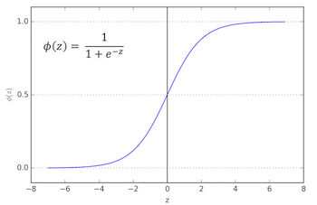
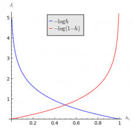
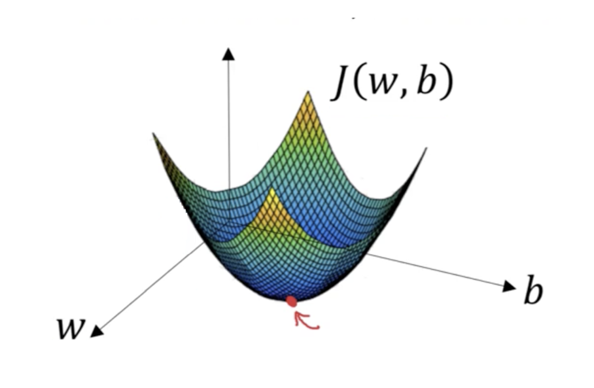

# Logistic Regression

> In [statistics](https://en.wikipedia.org/wiki/Statistics), the **logistic model** (or **logit model**) is a [statistical model](https://en.wikipedia.org/wiki/Statistical_model) that is usually taken to apply to a binary dependent variable. In [regression analysis](https://en.wikipedia.org/wiki/Regression_analysis), **logistic regression** or **logit regression** is [estimating](https://en.wikipedia.org/wiki/Estimation_theory) the parameters of a logistic model. More formally, a logistic model is one where the [log-odds](https://en.wikipedia.org/wiki/Log-odds) of the probability of an event is a [linear combination](https://en.wikipedia.org/wiki/Linear_function_(calculus)) of independent or predictor variables.

## Notation

- Input : $\{(x^{(1)}, y^{(1)}), (x^{(2)}, y^{(2)}), \cdots, (x^{(m)}, y^{(m)})\}$

- $m$ denotes the number of training examples

- $n$ denotes the number of features

- The matrices $X$ and $y$ are denoted by,

- $$
  X = \begin{bmatrix} 
  x^{(1)}_1 & x^{(2)}_1 & \cdots & x^{(m)}_1\\
  \vdots & \vdots & \cdots & \vdots\\
  x^{(1)}_n & x^{(2)}_n & \cdots & x^{(m)}_n\\
  \end{bmatrix} \in \mathbb{R^{n \times m}}
  \\[2ex]
  y = [y^{(1)}, y^{(2)}, \cdots, y^{(m)}] \in \mathbb{R^{1 \times m}}
  $$


## Problem Formulation

- Given $x$ we would like to predict $\hat{y} = \mathrm{P}(y=1\mid x)$ such that $\hat{y}^{(i)} \approx y^{(i)}$ for all training examples $i$. Which we define as the probability of $y$ being correctly classified (i.e, $y=1$) given some  training example $x$

- Parameters: 
  - Weights, $w \in \mathrm{R^n}$
  - Bias, $b \in \mathrm{R}$

- Output: 
$$
\hat{y} = \underbrace{\sigma(w^Tx + b)}_{z} \quad\text{, where $\sigma$ is the sigmoid function}
$$

- Sigmoid, $\sigma$ , is defined as:
  - $$
    \sigma(z) = \frac{1}{1 + e^{-z}}
    $$

  - Here's what the function looks like,

     

> The equation, $\hat{y} = w^Tx + b$, corresponds to Linear Regression. We apply the non-linearity to this function to 
>
> make it a Logistic Regression. In most cases the non-linearity applied is the sigmoid function denoted as $\sigma$

## Cost Function

> Loss function of linear regression is calculated by least squares method where $L(\hat{y}, y) = \frac{1}{2}(\hat{y} - y)^2$. 
>
> ==We cannot use the same loss for LogR as the cost function becomes non-convex.==

- Loss for LogR is given by 

  - $$
    L(\hat{y}, y) = -(y\log{(\hat{y})} + (1-y)\log{(1-\hat{y})})
    $$

  - If $y=1$: $L(\hat{y}, y) = -log(\hat{y}) \leftarrow \text{want $\hat{y}$ large}$

  - If $y=0$: $L(\hat{y}, y) = -log(1-\hat{y}) \leftarrow \text{want $\hat{y}$ small}$

  - Here's an image that helps illustrate the two points above, 

     

- Cost of LogR is given by

  - $$
    \begin{align}
    J(w,b) &= \frac{1}{m}\space\Sigma_{i=1}^mL(\hat{y}^{(i)},y^{(i)}) \label{eq5}\\
    &\text{or} \\
    J(w,b) &= -\frac{1}{m}\space\Sigma_{i=1}^m(y^{(i)}log(\hat{y}^{(i)}) + (1-y^{(i)})log({1-\hat{y}^{(i)}})) \\
    \end{align}
    $$

  - Cost fn is computed over all the training examples

#### Explanation

- The idea of  LogR is to predict for some $\hat{y} = \mathrm{P}(y=1\mid x)$

- That can be re-written as,

  - $$
    \mathrm{P}(y \mid x) = \begin{cases}
    \text{If} \quad y=1: \quad p(y \mid x) = \hat{y} \\
    \text{If} \quad y=0: \quad p(y \mid x) = 1 - \hat{y} \\
    \end{cases} \\
    \text{or} \\
    \mathrm{P}(y \mid x) = \hat{y}^y(1- \hat{y})^{(1-y)}
    $$

- Now since $\log$ is a strictly monotonically increasing fn, maximising $\log{\mathrm{P}(y \mid x)}$ should give you a similar result as maximising $\mathrm{P}(y \mid x)$

  - $$
    \begin{align}
    \log{\mathrm{P}(y \mid x)} &= \log{(\hat{y}^y(1- \hat{y})^{(1-y)})} \\
    &= y \log{(\hat{y})} + (1-y) \log{(1-\hat{y})}\\
    &= -L(\hat{y}, y)
    \end{align}
    $$

  - The negative sign exists as we would like to maximise the probability of a class which implies decreasing the loss defined as $L(\hat{y}, y)$ 

- Cost on $m$ examples is calculated by assuming that the training examples are drawn independently so that $p(\text{labels in training}) = \Pi_{I=1}^m p(y^{(i)} \mid x^{(i)})$ so,

  - $$
    \begin{align}
    \log{p(\cdots)} &= \log{\Pi_{I=1}^m p(y^{(i)} \mid x^{(i)})} \\
    &= \Sigma_{i=1}^m \log{p(y^{(i)} \mid x^{(i)})} \\
    &= - \Sigma_{i=1}^m L(\hat{y}^{(i)}, y^{(i)}) \label{eq14}\\
    \end{align}
    $$

  - According to maximum likelihood estimation we try to get the parameters that will maximise the expression in $\eqref{eq14}$, which is equivalent to saying (scaled by a factor of $m$),

  - $$
    \text{Minimise Cost : } J(w,b) = \frac{1}{m}\space\Sigma_{i=1}^mL(\hat{y}^{(i)},y^{(i)})
    $$


## Gradient Descent

- GD for LogR helps us find $w$ and $b$ such that the $J(w,b)$ cost minimises

- Here's an illustration where the $z$ axis represents the convex cost function $J(w,b)$ and the red dot denotes the local minima

  

- The formula for GD is given by,

  - $$
    \begin{align}
    \text{Repeat} &\{ \\
    &\quad w = w - \alpha \frac{\partial J(w,b)}{\partial w} \\
    &\quad b = b- \alpha \frac{\partial J(w,b)}{\partial b} \\
    &\}
    \end{align}
    $$


#### Computational Graph and Derivatives

- Our problem for LogR is defined by 3 major equations, 

  - $$
    \begin{align}
    z &= w^Tx \in \mathrm{R^{1 \times m}}\\
    \hat{y} &=  a = \sigma(z) = \frac{1}{1 + e^{-z}}\\
    L(a, y) &= -(y\log{(a)} + (1-y)\log{(1-a)}) \\
    \end{align}
    $$

  - This is what the computational graph looks like,

  - $$
    \boxed{z = w^Tx} \rightarrow \boxed{a = \sigma(z)} \rightarrow \boxed{L(a,y)}
    $$

  - Now imagine we have 2 features for **one training example** denoted by $x_1$ and $x_2$. It corresponds to 2 weights $w_1$ and $w_2$ and a bias term $b$ . Put together, $z = w_1x_1 + w_2x_2 + b$.We shall introduce a notation for the partial derivatives of a term wrt the loss $L(a,y)$, as $d\theta = \frac{\partial{L(a,y)}}{\partial{\theta}}$ for any derivative in all the code that follows.

  - So the computation graph with the derivatives looks as follows,

  - $$
    \boxed{z = w^Tx} \color{red}{\xleftarrow{dz = a - y}} \boxed{a = \sigma(z)} \color{red}{\xleftarrow{da =  -\frac{y}{a} + \frac{1-y}{1-a}}} \boxed{L(a,y)}
    $$

  - This is obtained through the chain rule,

  - $$
    \begin{alignat}{3}
    &da &= \frac{\partial{L(a,y)}}{\partial{a}} &= -\frac{y}{a} + \frac{1-y}{1-a} && \\
    &  &\frac{\partial{a}}{\partial{z}} &= a(1-a) && \\
    &dz &= \frac{\partial{L(a,y)}}{\cancel{\partial{a}}}.\frac{\cancel{\partial{a}}}{\partial{z}} &= a - y && \\
    &  &\frac{\partial{z}}{\partial{w_1}} &= x_1 && \\
    &  &\frac{\partial{z}}{\partial{w_2}} &= x_2 && \\
    &  &\frac{\partial{z}}{\partial{b}} &=  1&& \\
    &dw_1  &=\frac{\partial{L(a,y)}}{\cancel{\partial{z}}}.\frac{\cancel{\partial{z}}}{\partial{w_1}} &=  x_1dz&& \\
    &dw_2  &=\frac{\partial{L(a,y)}}{\cancel{\partial{z}}}.\frac{\cancel{\partial{z}}}{\partial{w_2}} &=  x_2dz&& \\
    &db  &=\frac{\partial{L(a,y)}}{\cancel{\partial{z}}}.\frac{\cancel{\partial{z}}}{\partial{b}} &=  dz&& \\
    \end{alignat}
    $$

  - > Remember that $\frac{d\log(x)}{dx} = \frac{1}{x}$ and $\frac{de^x}{dx} = e^x$

  - While coding the significant equations to remember are,

  - ```python
    dz = a - y
    dw1 = x1.dz
    dw2 = x2.dz
    db = dz
    
    # And the GD update rules are given by
    w1 -= alpha.dw1
    w2 -= alpha.dw2
    b -= alpha.db
    ```
#### GD on $m$ examples

- From $\eqref{eq5}$ we have and multiple training examples we calculate `dw1`,

  - $$
    \frac{\partial{J(w,b)}}{\partial{w_1}} = \frac{1}{m} \Sigma_{i=1}^m \underbrace{\frac{\partial{L(a^{(i)},y^{(i)})}}{\partial{w_1}}}_{dw_1^{(i)}} = \frac{1}{m} \Sigma_{i=1}^m dw_1^{(i)}
    $$

  - The pseudocode for **one step** of GD will be as follows,

  - >`J = dw1 = dw2 = db = 0`
    >
    >`for` $i=1\;$ to $\;m\;$
    >
    >$\quad\quad z^{(i)} = w^Tx^{(i)} + b $
    >$\quad\quad a^{(i)} = \sigma{(z^{(i)})} $
    >$\quad\quad J +=- (y^{(i)}log(a^{(i)}) + (1-y^{(i)})log({1-a^{(i)}}))$
    >$\quad\quad dz^{(i)} = a^{(i)} - y{(i)}$
    >
    >$\quad\quad$` dw1 +=`$x_1^{(i)}dz^{(i)}$
    >
    >$\quad\quad$` dw2 +=`$x_2^{(i)}dz^{(i)}$
    >
    >$\quad\quad$` db += `$dz^{(i)}$
    >
    >`J \= m`
    >
    >`dw1 \= m`
    >
    >`dw2 \= m`
    >
    >`db \= m`
    >
    >`w1 -= `$\alpha$`.dw1`
    >`w2 -= `$\alpha$`.dw2`
    >`b -= `$\alpha$`.db`

  > ==The above code is rather inefficient== because of the two loops it uses -
  >
  > - Iterating over $m$ examples
  > - Iterating over steps for GD
  >
  > For this reason we use the vectorised format of the code as given below

#### Vectorisation of GD

- Here's a vectorised implementation of LogR in Python,

- ```python
  # abc(i) implies i-th training sample
  import numpy as np
  
  # Sanity check for shapes of matrices
  X.shape == (n,m)
  y.shape == (1,m)
  w.shape == (n,1)
  Z.shape == (1,m)
  A.shape == (1,m)
  # b is a scalar
  
  for i in range(1000):
      # Z = [w(T)x(1)+b, w(T)x(2)+b, ..., w(T)x(m)+b]
      Z = np.dot(w.T, X) + b # highlights broadcasting
      # A = [a(1), a(2), ..., a(m)]
      A = sigma(z)
      
      # dz = [a(1) - y(1), a(2) - y(2), ..., a(m) - y(m)]
      dZ = A - y
      # db = 1/m * [dz(1), dz(2), ..., dz(m)]
      db = 1/m * np.sum(dZ)
      # dw = 1/m * [x(1)dz(1), x(2)dz(2), ..., x(m)dz(m)]
      dw = 1/m * np.dot(X, dZ.T)
  
      w -= alpha.dw
      b -= alpha.db
  ```


